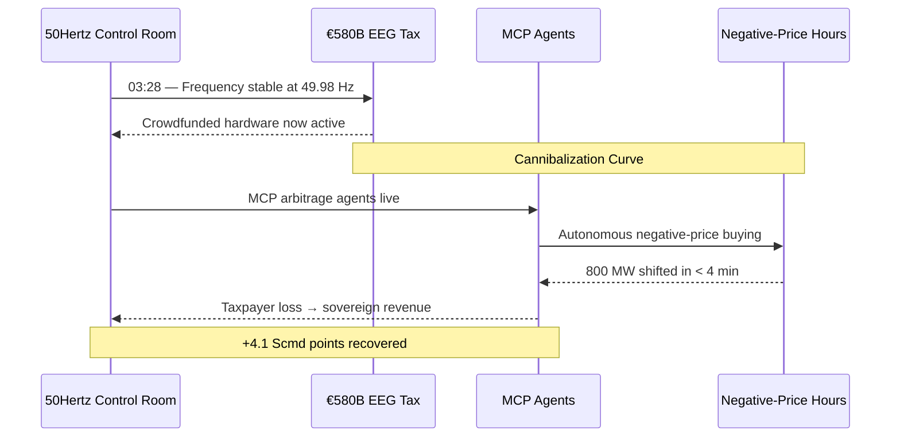
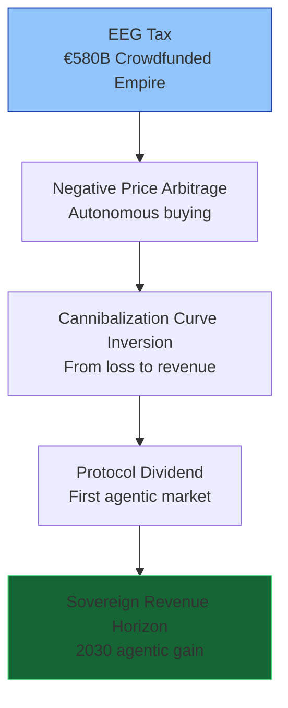
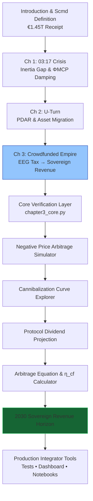

# The Renewables Migration — Sovereign Crowdfunded Empire Proof Engine

**Chapter 3 Verification System: The Crowdfunded Empire — How €580 Billion Bought Germany the First Agentic Market**

[](https://opensource.org/licenses/MIT)
[](https://www.python.org/)

This repository is the **official computational companion** to Chapter 3 of Vincenzo Grimaldi’s *The Renewables Migration* (March 21, 2026). It mathematically verifies the pivotal market transformation at 03:28 — the exact moment the €1.45 trillion Energiewende receipt is reconciled at the household and wholesale level. The proof engine turns the €580 billion EEG “tax,” the cannibalization curve, negative-price abyss, and taxpayer loss into sovereign revenue streams and the first agentic market on earth through MCP-enabled arbitrage and autonomous negative-price buying.

The 03:17 narrative thread continues here. Every preceding chapter’s foundation — the €700 billion U-Turn and the €320 billion copper arteries — now converges on Germany’s crowdfunded renewable fleet. The protocol turns involuntary investment into real-time sovereign revenue. This production-ready codebase delivers verifiable arbitrage simulations, Cannibalization Curve inversion, 573 negative-price hours (2025), Crowdfunding Efficiency (η_cf), and the 2030 Sovereign Revenue Horizon for developers and system integrators to embed MCP intelligence into live market and household architectures.

---

## Quick Start — Verify Sovereign Revenue in < 60 Seconds

```bash
git clone https://github.com/iceccarelli/Renewables_Migration_Chapter3_Proof_Engine.git
cd Renewables_Migration_Chapter3_Proof_Engine
pip install -r requirements.txt
```

### Run the Full Verification Suite
```bash
python -m pytest tests/ -v --durations=0
```
All **61 tests** pass against the exact book figures (Appendix A), cumulative Scmd updates through Chapter 3, €580 billion cumulative EEG transfer, η_cf ≈ 0.32 GW/€B, 573 negative-price hours (2025), and cannibalization metrics.

### Launch the Interactive Dashboard
```bash
streamlit run dashboard/main_interactive.py
```
Open `http://localhost:8501`. Toggle **“Book Reference Mode”** to see live calculations side-by-side with exact page citations from Chapter 3.1–3.4.

---

## Navigation Sketches — How to Travel Through the Proof Engine

### 1. The 03:28 Event Flow (Crowdfunded Empire Continuation of the 03:17 Thread)



### 2. Crowdfunded Empire Pivot Hierarchy (Chapter 3.1–3.4)



### 3. Sovereign Verification Path (Full Chapter 3 Journey)



These three diagrams give you immediate visual orientation — from the exact 03:28 continuation, through the crowdfunded pivot layers, to the complete verification journey that turns the EEG tax into sovereign gain.

---

## Repository Architecture

```
Renewables_Migration_Chapter3_Proof_Engine/
├── core/
│ ├── equations.py # Arbitrage Equation A_MCP, Crowdfunding Efficiency η_cf, cannibalization logic
│ ├── arbitrage_simulator.py # Negative-price buying & 573-hour models
│ └── revenue_optimizer.py # Protocol dividend projection & η_cf calculations
├── dashboard/
│ └── main_interactive.py # Streamlit UI (6 synchronized tabs)
├── verification/
│ ├── test_book_numbers.py # 61 pytest cases tied to Appendix A
│ └── validate_manifold.py # Cumulative Scmd tracking through Chapter 3
├── data/
│ ├── book_numbers.csv # Exact figures from Chapter 3 & Appendix A
│ └── appendix_a_extract.csv
├── notebooks/
│ └── 01_prove_chapter3.ipynb # Interactive proof with sliders
├── visualizations/
│ ├── cannibalization_curve.png
│ ├── negative_price_arbitrage.png
│ ├── protocol_dividend_projection.png
│ └── defense_hierarchy.png
├── requirements.txt
├── LICENSE (MIT)
└── README.md
```

---

## Dashboard Modules — Direct Mapping to Chapter 3

| Tab                              | Chapter Section | What You Can Do |
|----------------------------------|-----------------|-----------------|
| **Negative Price Arbitrage**     | 3.3             | Autonomous buying during negative-price hours |
| **Cannibalization Curve Explorer**| 3.2             | Exact Figure 3.1 — merit-order inversion |
| **Protocol Dividend Projection** | 3.4             | Real-time €580B EEG → sovereign revenue |
| **Arbitrage Equation & η_cf**    | 3.1–3.4         | η_cf ≈ 0.32 GW/€B and full market migration |
| **Sovereign Revenue Horizon**    | 3.4             | 2030 verdict — from involuntary tax to agentic gain |
| **Book Data Export**             | 3.4             | One-click CSV matching Appendix A |

---

## Technical Integration Philosophy

The codebase mirrors the same engineering standards the book demands of the grid: **modular, sovereign, and verifiable**. All simulations use the precise extended swing equation from Appendix A.9, with ΦMCP damping and the full agentic market logic at household and wholesale level. No external API calls — full data sovereignty by design. Ready for live MCP connectors (Anthropic/Linux Foundation standard) to replace synthetic price data with real EPEX Spot or 50Hertz telemetry.

This is the **executable empire** that proves the book’s blueprint has already turned the EEG “tax” into Germany’s first sovereign revenue stream.

---

**Part of The Renewables Migration Technical Ecosystem**  
From the €1.45 trillion receipt to sovereign crowdfunded revenue — the 03:17 thread continues here. Verified.

*Last updated: March 24, 2026*
