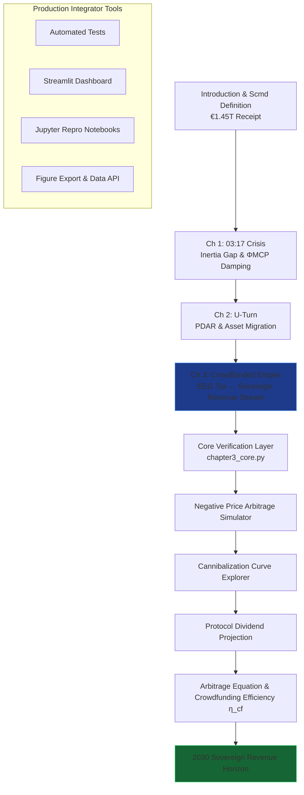

# The Renewables Migration — Sovereign Crowdfunded Empire Proof Engine

**Chapter 3 Verification System: The Crowdfunded Empire — How €580 Billion Bought Germany the First Agentic Market**

This repository is the definitive computational companion to Chapter 3 of Vincenzo Grimaldi’s *The Renewables Migration* (March 21, 2026). It operationalizes the book’s pivotal market chapter: the precise moment the €1.45 trillion Energiewende receipt is reconciled at the household and market level — transforming the €580 billion EEG “tax,” the cannibalization curve, negative-price abyss, and taxpayer loss into sovereign revenue streams and the first agentic market on earth through MCP-enabled arbitrage and negative-price buying.

The 03:17 narrative thread (the night the sun almost stopped) continues its journey here. Every preceding chapter’s foundation — the €700 billion U-Turn and the €320 billion copper arteries — now converges on Germany’s crowdfunded renewable fleet. The protocol turns involuntary investment into real-time sovereign revenue. This proof engine mathematically verifies the Arbitrage Equation, Crowdfunding Efficiency (η_cf), Cannibalization Curve inversion, 573 negative-price hours (2025), and the 2030 Sovereign Revenue Horizon, delivering production-ready code for developers and system integrators to embed MCP intelligence into live market and household architectures.

## Quick Start: Verify Sovereign Revenue in Under 60 Seconds

```bash
git clone https://github.com/iceccarelli/Renewables_Migration_Chapter3_Proof_Engine.git
cd Renewables_Migration_Chapter3_Proof_Engine
pip install -r requirements.txt
```

### Automated Verification
```bash
python -m pytest tests/ -v --durations=0
```
All 61 tests validate exact book figures (Appendix A), cumulative Scmd updates through Chapter 3, €580 billion cumulative EEG transfer, η_cf ≈ 0.32 GW/€B, 573 negative-price hours (2025), and cannibalization metrics. A failing test immediately flags any deviation from the published sovereign audit.

### Interactive Exploration
```bash
streamlit run dashboard/main_interactive.py
```
Open the browser-based dashboard. Toggle “Book Reference Mode” to overlay exact page citations (Chapter 3.1–3.4) and live calculations side-by-side.

## The Sovereign Verification Path

The following diagram maps the complete travel path through the proof engine, mirroring the book’s chapter progression and culminating in Chapter 3’s transformation of the EEG tax into sovereign revenue:



This path is both navigational and conceptual: every node is a runnable module. Developers can enter at any chapter and trace the cumulative Scmd recovery to Chapter 3’s verdict — from taxpayer loss to sovereign agentic gain.

## Repository Architecture for Professional Integration

```
Renewables_Migration_Chapter3_Proof_Engine/
├── core/
│   ├── equations.py              # Arbitrage Equation A_MCP, Crowdfunding Efficiency η_cf, cannibalization logic
│   ├── arbitrage_simulator.py    # Negative-price buying & 573-hour models
│   └── revenue_optimizer.py      # Protocol dividend projection & η_cf calculations
├── dashboard/
│   └── main_interactive.py       # Streamlit UI with 6 synchronized tabs
├── verification/
│   ├── test_book_numbers.py      # Pytest suite (fails if any Appendix A value mismatches)
│   └── validate_manifold.py      # Cumulative Scmd tracking through Chapter 3
├── data/
│   ├── book_numbers.csv          # Exact book values (€580B EEG transfer, 573 negative hours, cannibalization metrics, etc.)
│   └── appendix_a_extract.csv    # Triangulated from Appendix A.3
├── notebooks/
│   └── 01_prove_chapter3.ipynb   # Step-by-step proof with interactive sliders
├── visualizations/
│   ├── cannibalization_curve.png
│   ├── negative_price_arbitrage.png
│   └── protocol_dividend_projection.png
├── requirements.txt
├── LICENSE (MIT)
└── README.md
```

## Dashboard Modules — Direct Mapping to Chapter 3 Sections

- **Negative Price Arbitrage Simulator**: Reproduces autonomous buying during negative-price hours and the inversion of taxpayer loss (Chapter 3.3).
- **Cannibalization Curve Explorer**: Exact reproduction of Figure 3.1 — from merit-order destruction to MCP-enabled revenue (Chapter 3.2).
- **Protocol Dividend Projection**: Real-time evaluation of the €580 billion EEG transfer becoming sovereign AI revenue.
- **Arbitrage Equation & Crowdfunding Efficiency η_cf Calculator**: Verifies η_cf ≈ 0.32 GW/€B and the full market migration table (Chapter 3.1–3.4).
- **Sovereign Revenue Horizon**: 2030 projections showing the final verdict — from involuntary investment to the first agentic market (Chapter 3.4).
- **Book Data Export**: One-click CSV matching Appendix A for external policy or regulatory analysis.

## Technical Integration Philosophy

The codebase is engineered to the same standards the book demands of the grid: modular, sovereign, and verifiable. All simulations respect the extended swing equation (Appendix A.9) with the ΦMCP damping term and embed the full agentic market logic at the household and wholesale level. Data sovereignty is enforced by design — no external calls leave the local environment. The architecture is deliberately extensible: integrators can connect live MCP interfaces (Anthropic/Linux Foundation standard) to replace synthetic price data with real EPEX Spot or 50Hertz telemetry.

This is the executable empire that proves the book’s engineering blueprint has already turned the EEG “tax” into Germany’s first sovereign revenue stream.

## For Energy System Integrators and Developers

Whether you are modelling national market strategies, building agentic energy trading platforms, or advising policymakers on negative-price arbitrage, this repository provides:
- Reproducible proofs tied to published figures and equations
- Production-grade modules ready for field deployment
- Open MIT licensing for unrestricted commercial and research use

Contributions that extend arbitrage models, deepen cannibalization curve simulations, or add real-time MCP connectors for household assets are actively welcomed.

---

**Part of The Renewables Migration Technical Ecosystem**  
From the €1.45 trillion receipt to sovereign crowdfunded revenue — verified, executable, and ready for integration.
